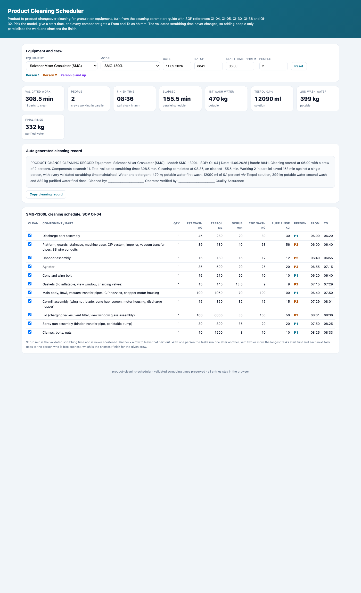

<div align="center">

# Product Cleaning Scheduler

**Granulation changeover cleaning, scheduled. Pick the equipment and model, give a start time, and every component gets a From and To as hh:mm. The validated scrubbing time never changes, so adding people only parallelises the work and shortens the finish.**

[](#)
[](#)
[](#)
[](#)
[](https://marknwilliam.github.io/product-cleaning-scheduler/)

</div>

---



## About

Product to product changeover cleaning has to respect the validated scrubbing time for every component, and it still has to finish as early as the shift allows. This tool holds the cleaning parameters for the granulation equipment, the Saizoner Mixer Granulator models SMG-1300L, SMG-1000L and SMG-150L (SOP OI-04), the Fluid Bed models FBE-1300L, FBE-800L and FBE-125L (SOP OI-05), the Gerteis Roll Compactor Macro-Pactor (SOP OI-30), the Conical Sieve Mill (SOP OI-36) and the Quadro Co-Mill U 20 (SOP OI-32). For each component it carries the potable water first wash, the 0.1 percent Teepol volume, the validated scrubbing time, the potable water second wash and the purified water final rinse.

The tool also writes a professional product change cleaning record for the logbook, with the equipment, model and SOP, the crew, the total validated scrubbing time, the finish and elapsed time, the minutes saved by working in parallel, the water and Teepol totals, and an operator and QA signature line. Give a start time and a crew size and the schedule lays itself out. One person cleans the components one after another. Add a second person and the longest tasks start first, each next task going to whoever is free soonest, so the finish comes in earlier without touching a single validated scrubbing time. Add more people and the finish keeps dropping until there are as many people as there are components.

## How the schedule is built

The problem is the classic parallel machine makespan, and the tool solves it with the longest processing time first rule, which is a proven greedy heuristic. Sort the components by validated scrubbing time, largest first. Give each one to the crew member with the least work so far. Then within each crew member run the assigned components in the original list order, stacking the From and To times one after the other. The elapsed time is the busiest crew member, and the finish is the start plus that elapsed time. Every task keeps its validated duration, so the crew only ever wins by working in parallel.

## Using the scheduler

Pick the equipment, then the model. Set the start time as hh:mm and the number of people. The table shows every component with its quantities and its validated scrubbing time, and the Person, From and To columns fill in live. Uncheck a component to leave it out, for example a part that is not fitted on the run. The strip on top reports the validated work in minutes, the crew size, the finish time, the elapsed minutes and the total water and Teepol, which is what Stores and the wash bay need to stage before the clean starts.

## Quick start

```bash
python3 -m unittest test_cleaning_scheduler.py
```

```python
import cleaning_scheduler as c

comps = c.components("SMG-1300L")          # 11 parts with validated scrub times
c.schedule(comps, people=1, start_min=360) # one person, tasks one after another
c.schedule(comps, people=2, start_min=360) # earlier finish, same validated times
c.water_totals(comps)                      # potable, Teepol and purified totals
```

## Repository layout

```
product-cleaning-scheduler/
├── index.html                 # interactive scheduler (open this)
├── cleaning_scheduler.py      # equipment data, scheduling and water totals
├── test_cleaning_scheduler.py # 21 unit tests
├── docs/                      # README preview screenshot
└── README.md
```

## License

MIT.